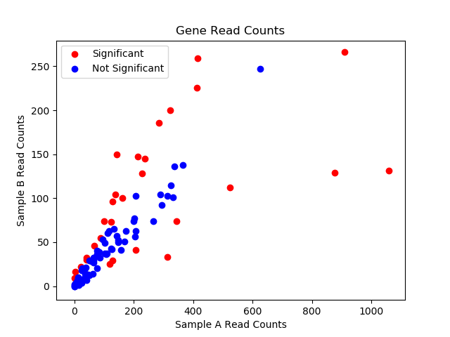

# read count scatter

This Python 3 program takes two sample files (tsv) and a base name for the output .pdf file, and returns a file (.pdf) containing a scatterplot of the readcounts for Sample A and Sample B.  

This program was developed to the specifications of the Program B assignment for Special Topic paper 247.782, 2018.

## Prerequisites

* [SciPy Stack 1.0](https://www.scipy.org/install.html)
* [StatsModels 0.9.0](https://www.statsmodels.org/dev/install.html)

## Clone

* Clone this repository to your local machine using `git clone https://github.com/annabehling/program_B`

## Usage

The basic usage of the program is:
```
./read_count_scatter.py sample_a sample_b scatter_name
```
Which produces a file:
`test.pdf`

## Example Usage

To perform a test run of read_count_scatter.py using the example data files `sampleA.txt` and `sampleB.txt` provided:

**Input:**
```
./read_count_scatter.py sampleA.txt sampleB.txt test
```
Where `sampleA.txt` and `sampleB.txt` are tsv files with two colums **and headings for each column**.  
The first column contains the gene names from the sample and the second column contains the readcount values for each gene.

The format of `sampleA.txt` looks like this:
```
gene	sampleA
EfM3.000010	21
EfM3.000020	63
EfM3.000030	42
EfM3.000040	8
EfM3.000050	206
EfM3.000060	202
EfM3.000070	129
EfM3.000080	89
EfM3.000090	11
EfM3.000100	326
```

The format of `sampleB.txt` looks like this:
```
gene	sampleB
EfM3.000010	8
EfM3.000020	14
EfM3.000030	7
EfM3.000040	3
EfM3.000050	41
EfM3.000060	77
EfM3.000070	96
EfM3.000080	55
EfM3.000090	5
EfM3.000100	115
```

And where `test` is the base name (str) for the .pdf file. 

**Output:**

Your output file should be `test.pdf`, which has also been provided as an example file.


`test.pdf` is a .pdf file containing a scatterplot of the readcounts for Sample A and Sample B.

The x and y axes of the scatterplot have been hardcoded.

**Sample A** corresponds to the first file parsed to the command line, in this example `sampleA.txt`  
**Sample B** corresponds to the second file parsed to the command line, in this example `sampleB.txt`

The points on the scatterplot (genes) are colour-coded for statistical significance of readcount difference.   
p=0.05, adjusted for multiple testing using FDR Benjamini-Hochberg.

### Error Messages

If the program usage is not followed, the program will return specific warnings and error messages.  
These will catch the errors in the example data file `sampleBprime.txt` when running:
```
./read_count_scatter.py sampleA.txt sampleBprime.txt test
```
No `test.pdf` file will be created. Instead, an error message will be returned:
```
Gene EfM3.000730 has invalid readcount value: "bob". Fatal error, no output written.
```
The list of errors in `sampleBprime.txt` are:
1. `EfM3.000510	1e8` The code will convert 1e8 to a float and proceed without an error
2. `EfM3.000730	bob` Returns a fatal error (overrides all warning messages)
3. `EfM3.blimey	74`  Returns a warning message
4. `EfM3.000010	8`   The ordering of gene names in each of the sample files is irrelevant due to the missing_genes() function 

## Acknowledgements

* Thank you to [David Winter](https://github.com/dwinter/) for his help with developing this program

## License

* [MIT](https://opensource.org/licenses/MIT)